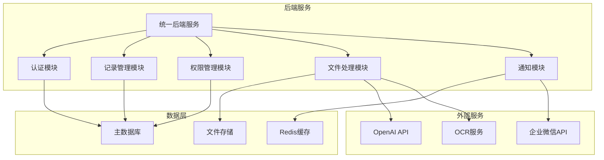
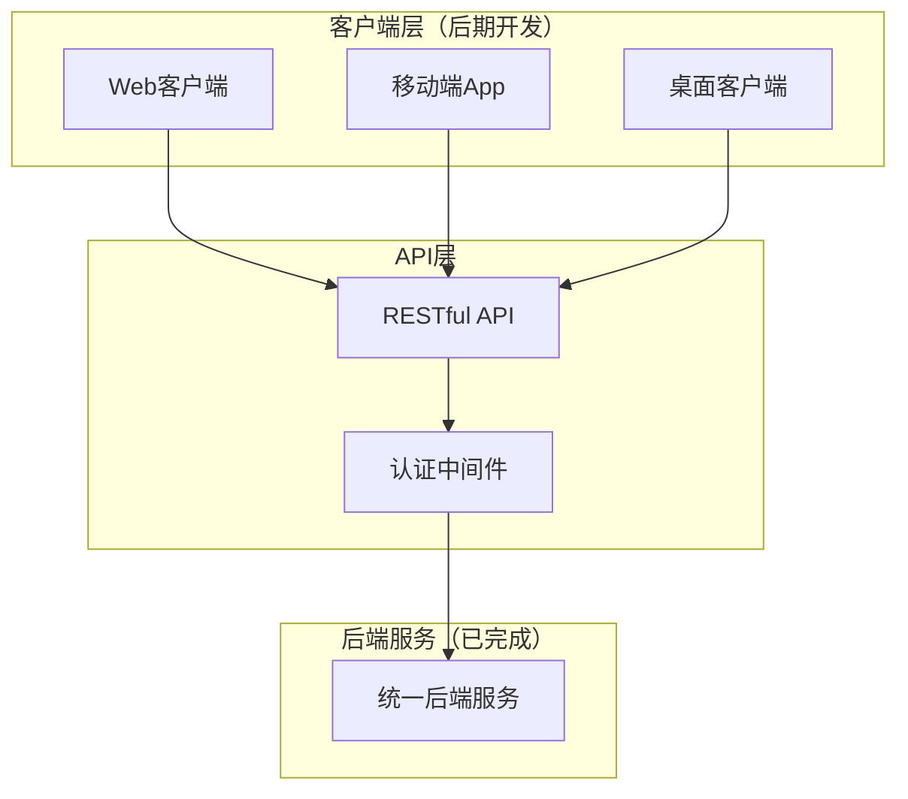

# 设计文档

## 概述

信息记录管理系统是一个基于前后端分离架构的企业级应用，采用后端优先的开发策略，确保系统稳定性和可部署性。系统设计遵循高可扩展性、高可用性和易维护性原则，通过模块化架构支持插件扩展和第三方集成。

### 核心设计原则

- **后端优先**：先完成后端API开发和测试，确保服务稳定后再开发前端
- **API优先**：RESTful API设计，支持多客户端和第三方集成
- **渐进式架构**：从单体应用开始，逐步演进为微服务架构
- **测试驱动**：每个API接口开发完成后立即进行测试验证
- **部署友好**：优化部署流程，避免前后端混合开发导致的问题
- **云原生**：容器化部署，支持水平扩展

## 架构

### 分阶段架构演进

#### 第一阶段：单体后端架构（当前目标）


#### 第二阶段：前端客户端接入


### 技术栈选择

基于"后端优先、稳定部署"的原则，采用以下技术栈：

#### 第一阶段：后端服务（优先开发）
- **主要语言**: Go 1.21+ (高性能、简洁、部署简单)
- **Web框架**: Gin (轻量级、性能好、文档完善)
- **数据库**: PostgreSQL 15+ (主库) + Redis 7+ (缓存)
- **ORM**: GORM v2 (成熟稳定、支持多数据库)
- **认证**: JWT + bcrypt (无状态认证)
- **日志**: logrus (结构化日志)
- **配置**: Viper (配置管理)
- **测试**: testify + httptest (单元测试和API测试)
- **容器化**: Docker (单容器部署，简化运维)

#### 数据库兼容策略
- **主要支持**: PostgreSQL (生产环境推荐)
- **开发支持**: SQLite (本地开发和测试)
- **扩展支持**: MySQL (企业环境兼容)
- **ORM抽象**: GORM统一接口，支持数据库切换

#### 第二阶段：前端客户端（后端完成后开发）
- **Web端**: Vue.js 3 + TypeScript + Vite
- **移动端**: Flutter (跨平台)
- **桌面端**: Electron (基于Web技术栈)

#### 部署策略
- **开发环境**: Docker Compose (一键启动)
- **生产环境**: Docker + Nginx (简单可靠)
- **数据库**: 独立部署或云服务
- **文件存储**: 本地存储或对象存储

## 组件和接口

### 核心微服务组件

#### 1. 用户服务 (User Service)
**职责**: 用户认证、授权、用户信息管理

**主要接口**:
```go
// 用户认证
POST /api/v1/auth/login
POST /api/v1/auth/logout
POST /api/v1/auth/refresh

// 用户管理
GET /api/v1/users/profile
PUT /api/v1/users/profile
GET /api/v1/users/{id}
```

**数据模型**:
```go
type User struct {
    ID          uint      `json:"id"`
    Username    string    `json:"username"`
    Email       string    `json:"email"`
    Role        string    `json:"role"`
    Permissions []string  `json:"permissions"`
    CreatedAt   time.Time `json:"created_at"`
    UpdatedAt   time.Time `json:"updated_at"`
}
```

#### 2. 记录服务 (Record Service)
**职责**: 各类信息记录的CRUD操作、分表管理

**主要接口**:
```go
// 记录管理
POST /api/v1/records
GET /api/v1/records
GET /api/v1/records/{id}
PUT /api/v1/records/{id}
DELETE /api/v1/records/{id}

// 批量操作
POST /api/v1/records/batch
POST /api/v1/records/import
```

**动态表结构**:
```go
type Record struct {
    ID          uint                   `json:"id"`
    Type        string                 `json:"type"`        // 记录类型
    Title       string                 `json:"title"`
    Content     map[string]interface{} `json:"content"`     // 动态字段
    Tags        []string               `json:"tags"`
    CreatedBy   uint                   `json:"created_by"`
    CreatedAt   time.Time              `json:"created_at"`
    UpdatedAt   time.Time              `json:"updated_at"`
    TableName   string                 `json:"table_name"`  // 分表名称
}
```

#### 3. 权限服务 (Permission Service)
**职责**: 基于RBAC的权限管理、数据访问控制

**主要接口**:
```go
// 权限检查
POST /api/v1/permissions/check
GET /api/v1/permissions/user/{user_id}

// 角色管理
GET /api/v1/roles
POST /api/v1/roles
PUT /api/v1/roles/{id}
```

**权限模型**:
```go
type Permission struct {
    ID       uint   `json:"id"`
    Resource string `json:"resource"`  // 资源类型
    Action   string `json:"action"`    // 操作类型 (read/write/delete)
    Scope    string `json:"scope"`     // 权限范围 (own/team/all)
}

type Role struct {
    ID          uint         `json:"id"`
    Name        string       `json:"name"`
    Permissions []Permission `json:"permissions"`
}
```

#### 4. 文件服务 (File Service)
**职责**: 文件上传、存储、OCR识别、格式转换

**主要接口**:
```go
// 文件操作
POST /api/v1/files/upload
GET /api/v1/files/{id}
DELETE /api/v1/files/{id}

// OCR识别
POST /api/v1/files/ocr
GET /api/v1/files/ocr/{task_id}
```

#### 5. AI服务 (AI Service)
**职责**: OpenAI集成、语音识别、智能建议

**主要接口**:
```go
// AI功能
POST /api/v1/ai/chat
POST /api/v1/ai/speech-to-text
POST /api/v1/ai/optimize-record
```

#### 6. 通知服务 (Notification Service)
**职责**: 多渠道消息推送、告警集成

**主要接口**:
```go
// 通知发送
POST /api/v1/notifications/send
GET /api/v1/notifications/user/{user_id}

// 告警集成
POST /api/v1/alerts/zabbix
POST /api/v1/alerts/wechat
```

#### 7. 导出服务 (Export Service)
**职责**: 多格式数据导出、模板管理

**主要接口**:
```go
// 数据导出
POST /api/v1/export/records
GET /api/v1/export/templates
POST /api/v1/export/templates
```

#### 8. 配置服务 (Config Service)
**职责**: 系统配置管理、插件管理

**主要接口**:
```go
// 配置管理
GET /api/v1/config
PUT /api/v1/config
GET /api/v1/config/plugins
POST /api/v1/config/plugins/{id}/enable
```

### 插件系统架构

#### 插件接口定义
```go
type Plugin interface {
    Name() string
    Version() string
    Initialize(config map[string]interface{}) error
    Execute(context PluginContext) (interface{}, error)
    Cleanup() error
}

type PluginContext struct {
    UserID    uint
    RecordID  uint
    Data      map[string]interface{}
    Config    map[string]interface{}
}
```

#### 插件生命周期管理
```go
type PluginManager struct {
    plugins map[string]Plugin
    hooks   map[string][]Plugin
}

func (pm *PluginManager) RegisterPlugin(plugin Plugin) error
func (pm *PluginManager) UnregisterPlugin(name string) error
func (pm *PluginManager) ExecuteHook(hookName string, context PluginContext) error
```

## 数据模型

### 核心数据模型

#### 动态表结构设计
```sql
-- 记录类型定义表
CREATE TABLE record_types (
    id SERIAL PRIMARY KEY,
    name VARCHAR(100) NOT NULL UNIQUE,
    display_name VARCHAR(200) NOT NULL,
    schema JSONB NOT NULL,  -- 字段定义
    table_name VARCHAR(100) NOT NULL,
    created_at TIMESTAMP DEFAULT NOW(),
    updated_at TIMESTAMP DEFAULT NOW()
);

-- 动态记录表模板
CREATE TABLE records_{type_name} (
    id SERIAL PRIMARY KEY,
    title VARCHAR(500) NOT NULL,
    content JSONB NOT NULL,  -- 动态字段存储
    tags TEXT[],
    created_by INTEGER REFERENCES users(id),
    created_at TIMESTAMP DEFAULT NOW(),
    updated_at TIMESTAMP DEFAULT NOW(),
    version INTEGER DEFAULT 1
);

-- 操作审计表
CREATE TABLE audit_logs (
    id SERIAL PRIMARY KEY,
    user_id INTEGER REFERENCES users(id),
    action VARCHAR(50) NOT NULL,
    resource_type VARCHAR(100) NOT NULL,
    resource_id INTEGER NOT NULL,
    old_values JSONB,
    new_values JSONB,
    ip_address INET,
    user_agent TEXT,
    created_at TIMESTAMP DEFAULT NOW()
);
```

#### 权限数据模型
```sql
-- 用户表
CREATE TABLE users (
    id SERIAL PRIMARY KEY,
    username VARCHAR(100) NOT NULL UNIQUE,
    email VARCHAR(255) NOT NULL UNIQUE,
    password_hash VARCHAR(255) NOT NULL,
    role_id INTEGER REFERENCES roles(id),
    is_active BOOLEAN DEFAULT TRUE,
    last_login TIMESTAMP,
    created_at TIMESTAMP DEFAULT NOW(),
    updated_at TIMESTAMP DEFAULT NOW()
);

-- 角色表
CREATE TABLE roles (
    id SERIAL PRIMARY KEY,
    name VARCHAR(100) NOT NULL UNIQUE,
    description TEXT,
    is_system BOOLEAN DEFAULT FALSE,
    created_at TIMESTAMP DEFAULT NOW()
);

-- 权限表
CREATE TABLE permissions (
    id SERIAL PRIMARY KEY,
    resource VARCHAR(100) NOT NULL,
    action VARCHAR(50) NOT NULL,
    scope VARCHAR(50) NOT NULL,
    UNIQUE(resource, action, scope)
);

-- 角色权限关联表
CREATE TABLE role_permissions (
    role_id INTEGER REFERENCES roles(id),
    permission_id INTEGER REFERENCES permissions(id),
    PRIMARY KEY (role_id, permission_id)
);
```

### 数据分表策略

#### 按记录类型分表
```go
type TableManager struct {
    db *gorm.DB
}

func (tm *TableManager) GetTableName(recordType string) string {
    return fmt.Sprintf("records_%s", strings.ToLower(recordType))
}

func (tm *TableManager) CreateTableIfNotExists(recordType string, schema map[string]interface{}) error {
    tableName := tm.GetTableName(recordType)
    
    // 动态创建表结构
    sql := tm.generateCreateTableSQL(tableName, schema)
    return tm.db.Exec(sql).Error
}
```

#### 数据库兼容层
```go
type DatabaseAdapter interface {
    Connect(config DatabaseConfig) error
    CreateTable(tableName string, schema TableSchema) error
    Query(sql string, args ...interface{}) ([]map[string]interface{}, error)
    Execute(sql string, args ...interface{}) error
}

type PostgreSQLAdapter struct{}
type MySQLAdapter struct{}
type SQLiteAdapter struct{}
```

## 错误处理

### 统一错误响应格式
```go
type APIResponse struct {
    Success bool        `json:"success"`
    Data    interface{} `json:"data,omitempty"`
    Error   *APIError   `json:"error,omitempty"`
    Meta    *Meta       `json:"meta,omitempty"`
}

type APIError struct {
    Code    string `json:"code"`
    Message string `json:"message"`
    Details string `json:"details,omitempty"`
}

type Meta struct {
    Page       int `json:"page,omitempty"`
    PageSize   int `json:"page_size,omitempty"`
    Total      int `json:"total,omitempty"`
    TotalPages int `json:"total_pages,omitempty"`
}
```

### 错误处理中间件
```go
func ErrorHandlerMiddleware() gin.HandlerFunc {
    return func(c *gin.Context) {
        c.Next()
        
        if len(c.Errors) > 0 {
            err := c.Errors.Last()
            
            var apiErr *APIError
            switch e := err.Err.(type) {
            case *ValidationError:
                apiErr = &APIError{
                    Code:    "VALIDATION_ERROR",
                    Message: e.Message,
                    Details: e.Details,
                }
                c.JSON(400, APIResponse{Success: false, Error: apiErr})
            case *AuthorizationError:
                apiErr = &APIError{
                    Code:    "AUTHORIZATION_ERROR",
                    Message: "Access denied",
                }
                c.JSON(403, APIResponse{Success: false, Error: apiErr})
            default:
                apiErr = &APIError{
                    Code:    "INTERNAL_ERROR",
                    Message: "Internal server error",
                }
                c.JSON(500, APIResponse{Success: false, Error: apiErr})
            }
        }
    }
}
```

### 重试机制
```go
type RetryConfig struct {
    MaxAttempts int
    Delay       time.Duration
    Backoff     float64
}

func WithRetry(fn func() error, config RetryConfig) error {
    var err error
    delay := config.Delay
    
    for i := 0; i < config.MaxAttempts; i++ {
        if err = fn(); err == nil {
            return nil
        }
        
        if i < config.MaxAttempts-1 {
            time.Sleep(delay)
            delay = time.Duration(float64(delay) * config.Backoff)
        }
    }
    
    return err
}
```

## 测试策略

### 测试金字塔

#### 单元测试 (70%)
```go
func TestUserService_CreateUser(t *testing.T) {
    // 测试用户创建逻辑
    userService := NewUserService(mockDB)
    
    user := &User{
        Username: "testuser",
        Email:    "test@example.com",
    }
    
    createdUser, err := userService.CreateUser(user)
    
    assert.NoError(t, err)
    assert.NotZero(t, createdUser.ID)
    assert.Equal(t, user.Username, createdUser.Username)
}
```

#### 集成测试 (20%)
```go
func TestRecordAPI_Integration(t *testing.T) {
    // 测试API端到端流程
    testDB := setupTestDatabase()
    defer cleanupTestDatabase(testDB)
    
    router := setupRouter(testDB)
    
    // 测试创建记录
    record := map[string]interface{}{
        "type":    "daily_report",
        "title":   "Test Report",
        "content": map[string]interface{}{"summary": "Test"},
    }
    
    w := httptest.NewRecorder()
    req := createJSONRequest("POST", "/api/v1/records", record)
    router.ServeHTTP(w, req)
    
    assert.Equal(t, 201, w.Code)
}
```

#### E2E测试 (10%)
```javascript
// 使用Cypress进行前端E2E测试
describe('Record Management', () => {
  it('should create and view a record', () => {
    cy.login('testuser', 'password')
    cy.visit('/records/new')
    
    cy.get('[data-cy=record-type]').select('daily_report')
    cy.get('[data-cy=record-title]').type('Test Daily Report')
    cy.get('[data-cy=record-content]').type('This is a test report')
    cy.get('[data-cy=submit-btn]').click()
    
    cy.url().should('include', '/records/')
    cy.contains('Test Daily Report').should('be.visible')
  })
})
```

### 性能测试
```go
func BenchmarkRecordService_CreateRecord(b *testing.B) {
    service := NewRecordService(testDB)
    
    b.ResetTimer()
    for i := 0; i < b.N; i++ {
        record := &Record{
            Type:    "benchmark_test",
            Title:   fmt.Sprintf("Benchmark Record %d", i),
            Content: map[string]interface{}{"data": "test"},
        }
        
        _, err := service.CreateRecord(record)
        if err != nil {
            b.Fatal(err)
        }
    }
}
```

### 安全测试
```go
func TestSecurity_SQLInjection(t *testing.T) {
    // 测试SQL注入防护
    maliciousInput := "'; DROP TABLE users; --"
    
    _, err := userService.GetUserByUsername(maliciousInput)
    
    // 应该返回"用户不存在"而不是数据库错误
    assert.Error(t, err)
    assert.IsType(t, &UserNotFoundError{}, err)
}

func TestSecurity_XSS(t *testing.T) {
    // 测试XSS防护
    maliciousContent := "<script>alert('xss')</script>"
    
    record := &Record{
        Title:   maliciousContent,
        Content: map[string]interface{}{"description": maliciousContent},
    }
    
    createdRecord, err := recordService.CreateRecord(record)
    
    assert.NoError(t, err)
    // 内容应该被转义
    assert.NotContains(t, createdRecord.Title, "<script>")
}
```
## 前端架构
设计

### 多平台客户端架构

#### Web客户端 (Vue.js 3)
```typescript
// 主应用架构
src/
├── components/          # 通用组件
│   ├── common/         # 基础组件
│   ├── forms/          # 表单组件
│   └── charts/         # 图表组件
├── views/              # 页面视图
│   ├── auth/           # 认证页面
│   ├── records/        # 记录管理
│   ├── dashboard/      # 仪表板
│   └── admin/          # 管理页面
├── stores/             # Pinia状态管理
├── composables/        # 组合式函数
├── plugins/            # 插件系统
├── utils/              # 工具函数
└── types/              # TypeScript类型定义

// 状态管理设计
interface AppState {
  user: UserState
  records: RecordState
  ui: UIState
  plugins: PluginState
}

// 插件系统接口
interface FrontendPlugin {
  name: string
  version: string
  install(app: App): void
  uninstall?(): void
}
```

#### 移动端 (Flutter)
```dart
// Flutter应用架构
lib/
├── core/               # 核心功能
│   ├── network/        # 网络层
│   ├── storage/        # 本地存储
│   └── utils/          # 工具类
├── features/           # 功能模块
│   ├── auth/           # 认证模块
│   ├── records/        # 记录模块
│   └── dashboard/      # 仪表板模块
├── shared/             # 共享组件
│   ├── widgets/        # UI组件
│   └── models/         # 数据模型
└── main.dart           # 应用入口

// 状态管理 (Bloc模式)
class RecordBloc extends Bloc<RecordEvent, RecordState> {
  final RecordRepository repository;
  
  RecordBloc({required this.repository}) : super(RecordInitial()) {
    on<LoadRecords>(_onLoadRecords);
    on<CreateRecord>(_onCreateRecord);
    on<UpdateRecord>(_onUpdateRecord);
  }
}
```

#### 桌面端 (Electron)
```typescript
// Electron主进程
const createWindow = () => {
  const mainWindow = new BrowserWindow({
    width: 1200,
    height: 800,
    webPreferences: {
      nodeIntegration: false,
      contextIsolation: true,
      preload: path.join(__dirname, 'preload.js')
    }
  })
  
  // 加载Web应用
  mainWindow.loadURL('http://localhost:3000')
}

// 预加载脚本 - 安全的API暴露
contextBridge.exposeInMainWorld('electronAPI', {
  openFile: () => ipcRenderer.invoke('dialog:openFile'),
  saveFile: (data: any) => ipcRenderer.invoke('dialog:saveFile', data),
  getSystemInfo: () => ipcRenderer.invoke('system:getInfo')
})
```

### 响应式设计系统

#### CSS设计令牌
```scss
// 设计令牌定义
:root {
  // 颜色系统
  --color-primary: #3b82f6;
  --color-secondary: #64748b;
  --color-success: #10b981;
  --color-warning: #f59e0b;
  --color-error: #ef4444;
  
  // 间距系统
  --spacing-xs: 0.25rem;
  --spacing-sm: 0.5rem;
  --spacing-md: 1rem;
  --spacing-lg: 1.5rem;
  --spacing-xl: 2rem;
  
  // 字体系统
  --font-size-xs: 0.75rem;
  --font-size-sm: 0.875rem;
  --font-size-base: 1rem;
  --font-size-lg: 1.125rem;
  --font-size-xl: 1.25rem;
  
  // 断点系统
  --breakpoint-sm: 640px;
  --breakpoint-md: 768px;
  --breakpoint-lg: 1024px;
  --breakpoint-xl: 1280px;
}

// 响应式混合器
@mixin responsive($breakpoint) {
  @media (min-width: var(--breakpoint-#{$breakpoint})) {
    @content;
  }
}
```

#### 组件设计系统
```vue
<!-- 基础按钮组件 -->
<template>
  <button 
    :class="buttonClasses"
    :disabled="disabled || loading"
    @click="handleClick"
  >
    <Icon v-if="loading" name="spinner" class="animate-spin" />
    <Icon v-else-if="icon" :name="icon" />
    <slot />
  </button>
</template>

<script setup lang="ts">
interface ButtonProps {
  variant?: 'primary' | 'secondary' | 'outline' | 'ghost'
  size?: 'sm' | 'md' | 'lg'
  icon?: string
  loading?: boolean
  disabled?: boolean
}

const props = withDefaults(defineProps<ButtonProps>(), {
  variant: 'primary',
  size: 'md'
})

const buttonClasses = computed(() => [
  'btn',
  `btn--${props.variant}`,
  `btn--${props.size}`,
  {
    'btn--loading': props.loading,
    'btn--disabled': props.disabled
  }
])
</script>
```

## 智能化功能设计

### OCR识别服务
```go
type OCRService struct {
    client *http.Client
    config OCRConfig
}

type OCRConfig struct {
    Provider    string // "tesseract", "azure", "google"
    APIKey      string
    Languages   []string
    Confidence  float64
}

type OCRResult struct {
    Text       string             `json:"text"`
    Confidence float64            `json:"confidence"`
    Regions    []OCRRegion        `json:"regions"`
    Language   string             `json:"language"`
    ProcessTime time.Duration     `json:"process_time"`
}

type OCRRegion struct {
    Text       string    `json:"text"`
    BoundingBox Rectangle `json:"bounding_box"`
    Confidence float64   `json:"confidence"`
}

func (s *OCRService) ProcessImage(imageData []byte, options OCROptions) (*OCRResult, error) {
    // 预处理图像
    processedImage, err := s.preprocessImage(imageData)
    if err != nil {
        return nil, err
    }
    
    // 调用OCR引擎
    result, err := s.callOCREngine(processedImage, options)
    if err != nil {
        return nil, err
    }
    
    // 后处理结果
    return s.postprocessResult(result), nil
}
```

### 语音识别服务
```go
type SpeechService struct {
    client *http.Client
    config SpeechConfig
}

type SpeechConfig struct {
    Provider     string // "azure", "google", "openai"
    APIKey       string
    Language     string
    SampleRate   int
    AudioFormat  string
}

type SpeechResult struct {
    Text        string        `json:"text"`
    Confidence  float64       `json:"confidence"`
    Duration    time.Duration `json:"duration"`
    Language    string        `json:"language"`
    Segments    []SpeechSegment `json:"segments"`
}

type SpeechSegment struct {
    Text       string        `json:"text"`
    StartTime  time.Duration `json:"start_time"`
    EndTime    time.Duration `json:"end_time"`
    Confidence float64       `json:"confidence"`
}

func (s *SpeechService) ProcessAudio(audioData []byte, options SpeechOptions) (*SpeechResult, error) {
    // 音频预处理
    processedAudio, err := s.preprocessAudio(audioData)
    if err != nil {
        return nil, err
    }
    
    // 调用语音识别API
    result, err := s.callSpeechAPI(processedAudio, options)
    if err != nil {
        return nil, err
    }
    
    return result, nil
}
```

### AI集成服务
```go
type AIService struct {
    openaiClient *openai.Client
    config       AIConfig
}

type AIConfig struct {
    OpenAIKey    string
    Model        string
    MaxTokens    int
    Temperature  float32
}

type AIRequest struct {
    Type    string                 `json:"type"`    // "optimize", "suggest", "analyze"
    Content map[string]interface{} `json:"content"`
    Context map[string]interface{} `json:"context"`
}

type AIResponse struct {
    Result      string                 `json:"result"`
    Suggestions []string               `json:"suggestions"`
    Confidence  float64                `json:"confidence"`
    Metadata    map[string]interface{} `json:"metadata"`
}

func (s *AIService) OptimizeRecord(record *Record) (*AIResponse, error) {
    prompt := s.buildOptimizationPrompt(record)
    
    response, err := s.openaiClient.CreateChatCompletion(
        context.Background(),
        openai.ChatCompletionRequest{
            Model: s.config.Model,
            Messages: []openai.ChatCompletionMessage{
                {
                    Role:    openai.ChatMessageRoleSystem,
                    Content: "You are an expert at optimizing information records.",
                },
                {
                    Role:    openai.ChatMessageRoleUser,
                    Content: prompt,
                },
            },
            MaxTokens:   s.config.MaxTokens,
            Temperature: s.config.Temperature,
        },
    )
    
    if err != nil {
        return nil, err
    }
    
    return s.parseAIResponse(response), nil
}
```

## 部署和运维

### 容器化部署

#### Docker配置
```dockerfile
# 后端服务Dockerfile
FROM golang:1.21-alpine AS builder

WORKDIR /app
COPY go.mod go.sum ./
RUN go mod download

COPY . .
RUN CGO_ENABLED=0 GOOS=linux go build -o main ./cmd/server

FROM alpine:latest
RUN apk --no-cache add ca-certificates tzdata
WORKDIR /root/

COPY --from=builder /app/main .
COPY --from=builder /app/configs ./configs

EXPOSE 8080
CMD ["./main"]
```

```dockerfile
# 前端Dockerfile
FROM node:18-alpine AS builder

WORKDIR /app
COPY package*.json ./
RUN npm ci --only=production

COPY . .
RUN npm run build

FROM nginx:alpine
COPY --from=builder /app/dist /usr/share/nginx/html
COPY nginx.conf /etc/nginx/nginx.conf

EXPOSE 80
CMD ["nginx", "-g", "daemon off;"]
```

#### Kubernetes部署配置
```yaml
# 后端服务部署
apiVersion: apps/v1
kind: Deployment
metadata:
  name: info-system-backend
spec:
  replicas: 3
  selector:
    matchLabels:
      app: info-system-backend
  template:
    metadata:
      labels:
        app: info-system-backend
    spec:
      containers:
      - name: backend
        image: info-system/backend:latest
        ports:
        - containerPort: 8080
        env:
        - name: DATABASE_URL
          valueFrom:
            secretKeyRef:
              name: db-secret
              key: url
        - name: REDIS_URL
          valueFrom:
            configMapKeyRef:
              name: app-config
              key: redis-url
        resources:
          requests:
            memory: "256Mi"
            cpu: "250m"
          limits:
            memory: "512Mi"
            cpu: "500m"
        livenessProbe:
          httpGet:
            path: /health
            port: 8080
          initialDelaySeconds: 30
          periodSeconds: 10
        readinessProbe:
          httpGet:
            path: /ready
            port: 8080
          initialDelaySeconds: 5
          periodSeconds: 5
---
apiVersion: v1
kind: Service
metadata:
  name: info-system-backend-service
spec:
  selector:
    app: info-system-backend
  ports:
  - protocol: TCP
    port: 80
    targetPort: 8080
  type: ClusterIP
```

### 一键部署脚本
```bash
#!/bin/bash
# deploy.sh - 一键部署脚本

set -e

# 配置变量
PROJECT_NAME="info-management-system"
DOCKER_REGISTRY="your-registry.com"
NAMESPACE="production"

# 颜色输出
RED='\033[0;31m'
GREEN='\033[0;32m'
YELLOW='\033[1;33m'
NC='\033[0m'

log() {
    echo -e "${GREEN}[INFO]${NC} $1"
}

warn() {
    echo -e "${YELLOW}[WARN]${NC} $1"
}

error() {
    echo -e "${RED}[ERROR]${NC} $1"
    exit 1
}

# 检查依赖
check_dependencies() {
    log "检查部署依赖..."
    
    command -v docker >/dev/null 2>&1 || error "Docker 未安装"
    command -v kubectl >/dev/null 2>&1 || error "kubectl 未安装"
    
    log "依赖检查完成"
}

# 构建镜像
build_images() {
    log "构建Docker镜像..."
    
    # 构建后端镜像
    docker build -t ${DOCKER_REGISTRY}/${PROJECT_NAME}/backend:latest ./backend
    
    # 构建前端镜像
    docker build -t ${DOCKER_REGISTRY}/${PROJECT_NAME}/frontend:latest ./frontend
    
    log "镜像构建完成"
}

# 推送镜像
push_images() {
    log "推送镜像到仓库..."
    
    docker push ${DOCKER_REGISTRY}/${PROJECT_NAME}/backend:latest
    docker push ${DOCKER_REGISTRY}/${PROJECT_NAME}/frontend:latest
    
    log "镜像推送完成"
}

# 部署到Kubernetes
deploy_to_k8s() {
    log "部署到Kubernetes..."
    
    # 创建命名空间
    kubectl create namespace ${NAMESPACE} --dry-run=client -o yaml | kubectl apply -f -
    
    # 应用配置
    kubectl apply -f k8s/configmap.yaml -n ${NAMESPACE}
    kubectl apply -f k8s/secret.yaml -n ${NAMESPACE}
    
    # 部署数据库
    kubectl apply -f k8s/postgres.yaml -n ${NAMESPACE}
    kubectl apply -f k8s/redis.yaml -n ${NAMESPACE}
    
    # 部署应用
    kubectl apply -f k8s/backend.yaml -n ${NAMESPACE}
    kubectl apply -f k8s/frontend.yaml -n ${NAMESPACE}
    kubectl apply -f k8s/ingress.yaml -n ${NAMESPACE}
    
    log "Kubernetes部署完成"
}

# 健康检查
health_check() {
    log "执行健康检查..."
    
    # 等待Pod就绪
    kubectl wait --for=condition=ready pod -l app=info-system-backend -n ${NAMESPACE} --timeout=300s
    kubectl wait --for=condition=ready pod -l app=info-system-frontend -n ${NAMESPACE} --timeout=300s
    
    # 检查服务状态
    backend_status=$(kubectl get pods -l app=info-system-backend -n ${NAMESPACE} -o jsonpath='{.items[0].status.phase}')
    frontend_status=$(kubectl get pods -l app=info-system-frontend -n ${NAMESPACE} -o jsonpath='{.items[0].status.phase}')
    
    if [[ "$backend_status" == "Running" && "$frontend_status" == "Running" ]]; then
        log "健康检查通过"
    else
        error "健康检查失败"
    fi
}

# 主函数
main() {
    log "开始部署 ${PROJECT_NAME}..."
    
    check_dependencies
    build_images
    push_images
    deploy_to_k8s
    health_check
    
    log "部署完成！"
    log "访问地址: https://your-domain.com"
}

# 执行部署
main "$@"
```

### 监控和日志

#### Prometheus监控配置
```yaml
# prometheus.yml
global:
  scrape_interval: 15s

scrape_configs:
  - job_name: 'info-system-backend'
    static_configs:
      - targets: ['info-system-backend-service:80']
    metrics_path: /metrics
    scrape_interval: 10s

  - job_name: 'info-system-postgres'
    static_configs:
      - targets: ['postgres-exporter:9187']

  - job_name: 'info-system-redis'
    static_configs:
      - targets: ['redis-exporter:9121']
```

#### 日志聚合配置
```yaml
# fluentd配置
apiVersion: v1
kind: ConfigMap
metadata:
  name: fluentd-config
data:
  fluent.conf: |
    <source>
      @type tail
      path /var/log/containers/*info-system*.log
      pos_file /var/log/fluentd-containers.log.pos
      tag kubernetes.*
      format json
      time_format %Y-%m-%dT%H:%M:%S.%NZ
    </source>
    
    <match kubernetes.**>
      @type elasticsearch
      host elasticsearch-service
      port 9200
      index_name info-system-logs
      type_name _doc
    </match>
```

### 备份和恢复

#### 数据库备份脚本
```bash
#!/bin/bash
# backup.sh - 数据库备份脚本

BACKUP_DIR="/backups"
DATE=$(date +%Y%m%d_%H%M%S)
DB_NAME="info_system"

# 创建备份
pg_dump -h postgres-service -U postgres -d ${DB_NAME} > ${BACKUP_DIR}/backup_${DATE}.sql

# 压缩备份文件
gzip ${BACKUP_DIR}/backup_${DATE}.sql

# 清理旧备份（保留30天）
find ${BACKUP_DIR} -name "backup_*.sql.gz" -mtime +30 -delete

echo "备份完成: backup_${DATE}.sql.gz"
```

#### 自动备份CronJob
```yaml
apiVersion: batch/v1
kind: CronJob
metadata:
  name: database-backup
spec:
  schedule: "0 2 * * *"  # 每天凌晨2点
  jobTemplate:
    spec:
      template:
        spec:
          containers:
          - name: backup
            image: postgres:15
            command:
            - /bin/bash
            - -c
            - |
              pg_dump -h postgres-service -U postgres -d info_system | gzip > /backup/backup_$(date +%Y%m%d_%H%M%S).sql.gz
            volumeMounts:
            - name: backup-storage
              mountPath: /backup
          volumes:
          - name: backup-storage
            persistentVolumeClaim:
              claimName: backup-pvc
          restartPolicy: OnFailure
```

这个设计文档现在包含了完整的系统架构、前端设计、智能化功能、部署运维等所有关键方面。系统采用现代化的微服务架构，支持多平台客户端，具备强大的扩展性和智能化功能。